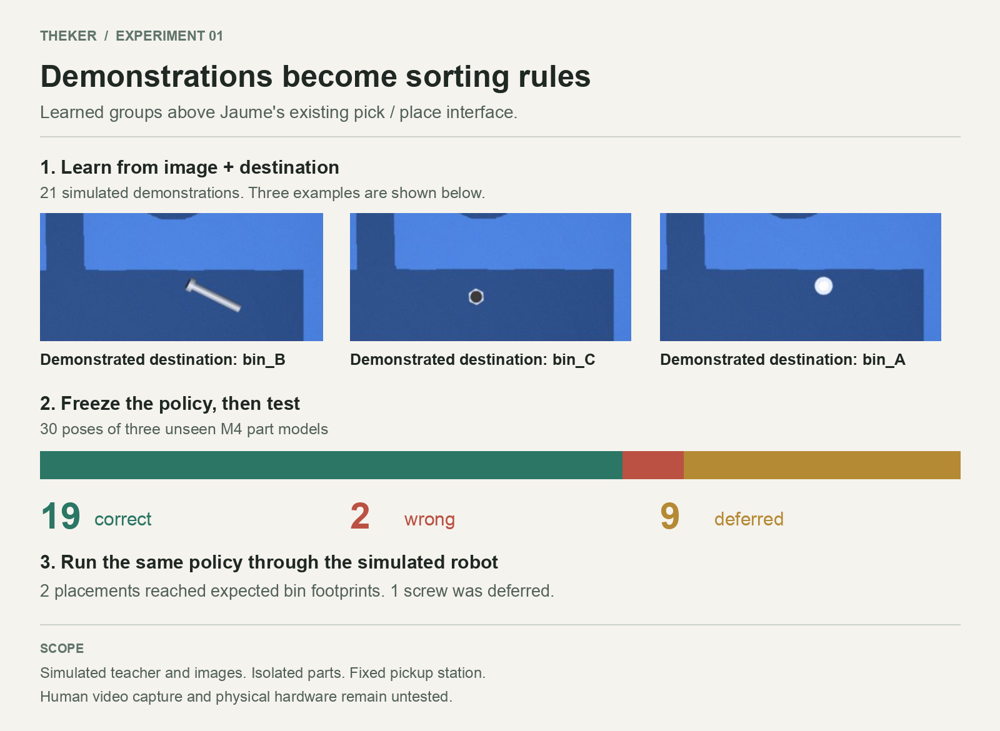

# Learn sorting groups from demonstrations

Taras selected high-level robot actions for the first learning boundary.
The policy maps image features to a demonstrated destination.
The contract executes `pick_at` and `place_in` after a policy decision.

## Meaning of a learned group

A learned group contains items with one demonstrated destination.
Separating touching objects remains outside this experiment.

## v1 result

The v1 dataset contains 69 simulated camera crops from Jaume's `theker_v1` renderer.
It contains three initial M3 demonstrations and 18 additional M3 demonstrations.
It contains 18 validation poses of the same M3 models.
It contains 30 held-out poses of three M4 fixtures.

The candidate policy used 21 demonstrations.
It produced 19 correct assignments, two wrong assignments, and nine deferrals across 30 held-out poses.
The accepted assignments had 19/21 accuracy.
The full test-set accuracy was 19/30.

The baseline ungated nearest assignment scored 24/30.
The candidate ungated nearest assignment scored 28/30.
This comparison is diagnostic.
It does not describe accepted-action accuracy because the gate deferred nine poses.

The validation set used new poses of training M3 models.
It did not use new part models.
The M4 fixtures only appear in the held-out test set.



## Simulated smoke result

The smoke run used Jaume's `RobotAPI`, `ArmController`, `SimArduino`, and MuJoCo.
Two predicted actions reached expected bin footprints in the simulator.
One screw prediction deferred before an action.
The taught pickup location was fixed at `(8, 0)` cm.
It was not visual localization.

Each receipt records `reported_ok` and `task_verified` separately.
`reported_ok` records the adapter result from an action.
`task_verified` remains `null` because no independent task verifier exists.
The simulated footprint check does not prove a correct physical sort.

## Reproduce v1

Run these commands from the repository root.

```bash
python3.14 -m venv contracts/.venv
contracts/.venv/bin/python -m pip install mujoco==3.13.0 numpy==2.4.4 opencv-python==5.0.0.93 pillow==12.1.1

contracts/.venv/bin/python contracts/learning/sim_dataset.py contracts/learning/results/v1/dataset
contracts/.venv/bin/python contracts/learning/run_experiment.py \
  --dataset contracts/learning/results/v1/dataset/records.json \
  --out contracts/learning/results/v1/evaluation
contracts/.venv/bin/python contracts/learning/sim_smoke.py \
  --policy contracts/learning/results/v1/evaluation/policy.json \
  --out contracts/learning/results/v1/smoke

PYTHONDONTWRITEBYTECODE=1 contracts/.venv/bin/python -m unittest discover \
  -s contracts/learning -p 'test_*.py' -v
RUN_RENDER_TESTS=1 PYTHONDONTWRITEBYTECODE=1 contracts/.venv/bin/python -m unittest discover \
  -s contracts/learning -p 'test_*.py' -v
```

The renderer requires host graphics access.
Default tests reported 14 passed and one skipped rendering test.
The 69-frame capture and smoke run succeeded separately with host graphics.

## OpenRouter and Jev experiment

The v2 experiment is complete.
OpenRouter vision describes each object, and TypeSafe Jev selects its demonstrated destination.
With three demonstrations, it assigned 28 test images correctly and deferred two.
With 21 demonstrations, it assigned all 30 correctly.
All 30 predictions followed changed demonstration labels.
The Jev policy drove three simulated placements to their expected bin footprints.

Read the [architecture and commands](JEV.md) and [results](results/v2/report.md).
The default suite passes 28 tests and skips one rendering test.
After synchronization to `91f6200`, all 29 tests passed with host graphics enabled.
Three simulated sorts also passed using exact matches to cached provider requests, with no new API calls.
See the [compatibility results](results/compatibility-91f6200.json).

## Limits

All demonstrations use simulated labels.
Human video extraction remains unimplemented.
Arbitrary cluster discovery remains unimplemented.
Physical hardware evaluation remains unimplemented.
