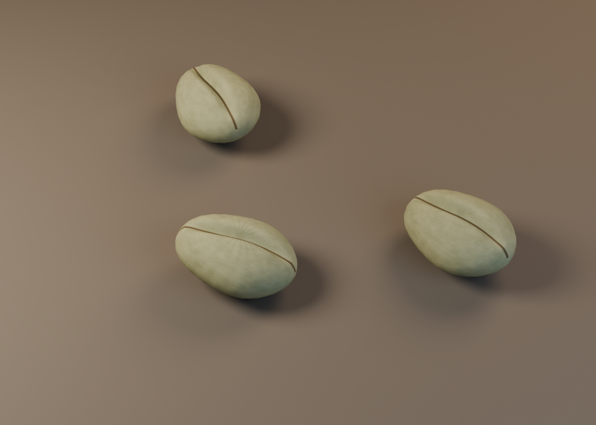
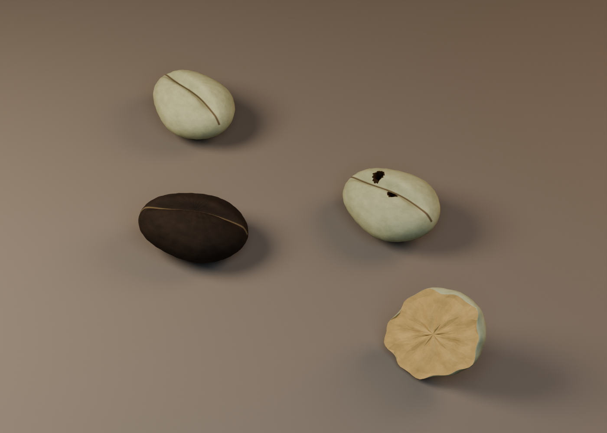
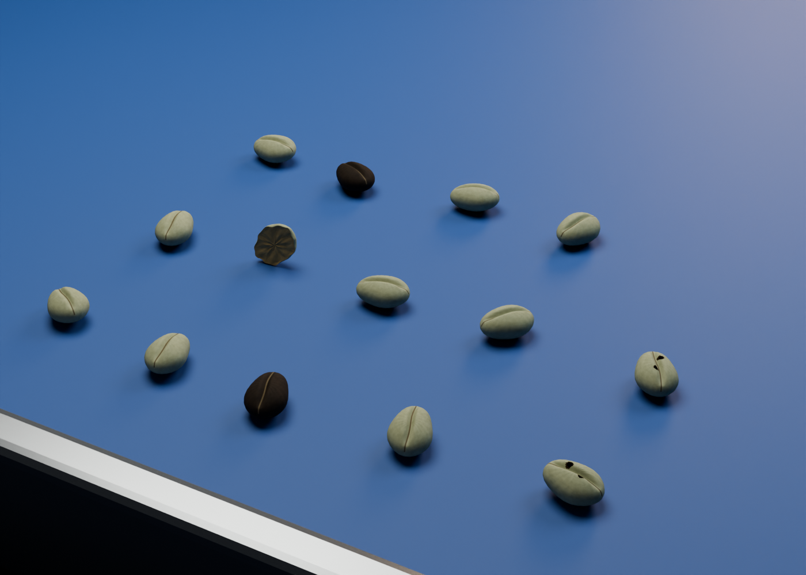

# Coffee bean visual proof

Four original presentation meshes for green arabica, black, insect-damaged and broken beans. This package is separate from the simulator and inspection-camera pipeline. Taras owns visual acceptance; these stills are review material, not classifier validation or a cinematic film.

Deliverable B adds a [one-second recorded-motion proof, GLB browser LODs, mapping and recording recipe](RECORDING.md). The stills and hero library below remain unchanged.

## Reproduce

Use Blender 4.5.4 LTS. No Python pip dependencies or external textures are required by the asset scripts. All materials are procedural and saved in the `.blend` files.

From the repository root, after installing Blender as described in [INSTALL.md](INSTALL.md):

```bash
export BLENDER=/workspace/personal/tools/blender-4.5.4-linux-x64/blender
export LD_LIBRARY_PATH=/workspace/personal/tools/blender-libs/root/usr/lib/x86_64-linux-gnu${LD_LIBRARY_PATH:+:$LD_LIBRARY_PATH}
export OMP_NUM_THREADS=16 OPENBLAS_NUM_THREADS=1 MKL_NUM_THREADS=1
```

```bash
# Regenerate the reusable library, four metre-scale OBJs and dimensions manifest.
"$BLENDER" --background --threads 16 --python-exit-code 1 \
  --python sim/coffee_sorter/visual_assets/build_assets.py

# Small, cheap pipeline proof before full renders.
"$BLENDER" --background --threads 16 --python-exit-code 1 \
  --python sim/coffee_sorter/visual_assets/render_stills.py -- --shot good --preview

# Run sequentially: never start multiple 16-thread renders on this host.
for shot in good defects conveyor; do
  "$BLENDER" --background --threads 16 --python-exit-code 1 \
    --python sim/coffee_sorter/visual_assets/render_stills.py -- --shot "$shot"
done
```

Outputs default to `visual_assets/generated/` and `visual_assets/renders/`, independent of your current working directory. `--output-dir /absolute/path` selects another destination. `--samples 32` overrides the sample cap. The scripts select CPU Cycles and at most 16 render threads; the command/environment also cap Blender and OpenMP.

Open `generated/coffee_bean_library.blend` in Blender and inspect the `CoffeeBeanPrototypes` collection. It contains four overlapping objects at their correct origins; hide all except the one you want to inspect. The per-shot `.blend` files have staged, separated instances and ready cameras. Press F12 in one of them to rerender. Shader textures are procedural; OBJs carry geometry only, while the `.blend` carries materials.

## Stills







The mixed-defect arrangement is good at upper left, black at lower left, insect-damaged at upper right and broken at lower right. The conveyor is a staged close-up using the simulator's belt length/width/height and inspection x coordinate; bean positions are composed for inspection and are not recorded simulation trajectories. Rail/housing appearance is illustrative. No outcome, sorting decision or throughput is implied.

The original first pipeline preview is retained in `evidence/first-preview.png`; it was reported immediately and deliberately remains an overexposed draft. Intermediate previews can differ from final source as lighting and geometry were refined. Final stills and the generated library were rebuilt together after the source was frozen.

## Visual limitations

The assets are procedural prototypes, not scans or calibrated photographs. Each class has one geometric prototype; clones vary orientation and albedo by at most ±3%, so repetition can become visible. The insect example has two fixed irregular blind bores, without branching internal galleries. The broken example preserves the simulator's half-bean topology/frame and has a rough cap, but it does not represent every natural break direction. Skin is procedural noise and small mesh wrinkles rather than a captured silver-skin texture. Very fine detail remains limited by the mesh and sampling. Some radial shading remains near the mesh pole and fracture centre, and the centre crease is more regular than a scanned bean. These are draft review assets; photorealistic acceptance belongs to Taras.

## Existing checks

No new tests or QA framework were added. Existing replay build passed: 1,842,120-byte HTML. Replay tests: 6 run, 5 passed, 1 optional physics comparison skipped. Simulator tests: 66 run, 65 passed, 1 optional UR5e picking module skipped (missing imageio). Separate Blender inspection confirmed closed manifold meshes, valid material indices, deterministic OBJ export, unchanged metre bounds, unit scales and seated stage instances.

Copy-paste commands for the existing checks:

```bash
(cd sim/coffee_sorter/web && npm ci && npm run build && npm test)
(cd sim/coffee_sorter && \
  MUJOCO_GL=osmesa PYOPENGL_PLATFORM=osmesa \
  LD_LIBRARY_PATH=/workspace/personal/coffee-gl/root/usr/lib/x86_64-linux-gnu \
  OMP_NUM_THREADS=1 OPENBLAS_NUM_THREADS=1 MKL_NUM_THREADS=1 \
  /workspace/personal/venvs/coffee-sorter/bin/python -m unittest discover -p 'test_*.py' -v)
```

The latter command uses the pre-existing local simulator environment. For a fresh host, follow `../README.md` and `../setup_mesa.sh`.

## Coordinate contract

Blender units are metres, z is up and the bean's long axis is x. Mesh object scale is `(1, 1, 1)`.

The simulator samples regular bean semi-axes in x/y/z ranges 4.2–5.6 / 3.1–4.0 / 2.2–2.9 mm. Good, black and insect prototypes use the midpoint: **9.8 × 7.1 × 5.1 mm** full dimensions, centred at the simulator body origin. These are nominal prototypes, not one universal replacement for every random size in a recorded replay. Matching a different recorded instance requires its recorded dimensions; no simulator state is changed here.

Broken uses the original `half_bean.obj` coordinate frame and the nominal `scene.py` scale `(0.0050, 0.0036, 0.0026)` m. The origin is on its cut plane, not the centre of its bounding box. The original source mesh's extent is x `±1`, y `±0.99767`, z `0..0.98751` before scale. Simulator variants multiply this nominal scale by 0.9, 1.0 or 1.1. The generator records its final bounds for inspection.

## Scope and provenance

Delivered on the explicitly requested base `4dbc350d6586f33c3030de44a346c3d7caa0d892`. Fork `main` at initial inspection was `1468992`, an ancestor. A trial rebase onto newer integration revision `86a7a362ef6807767bd0f2c5f577cc9d380acb20` exposed its existing `test_protected_sources_match_task_start_commit` failure for `vision.py`: actual hash `b539b9a9...` differs from pinned `04aa92db...`. The visual branch therefore retains the authorized original baseline and passing suite; the other branch was not changed. Bean profiles, source mesh, layout and replay inputs match both revisions. Merging onto the newer integration branch will inherit that unrelated test failure until its owners reconcile the pinned invariant. The draft PR is stacked against that integration branch to isolate the asset diff. The upstream PR could not be inspected with the available GitHub credentials; the source revision was verified through the fork's Git refs instead.

References and reuse decisions: [REFERENCES.md](REFERENCES.md). No reference imagery is included or used as a texture.

No existing simulation, classifier, inspection-camera material, controller, exporter or viewer file is modified. Integration into the replay viewer is a later visual-only step. Deliverable B includes only a one-second movie proof; no app deployment or full film is included.

## Measured delivery

Times below measure the `bpy.ops.render.render(write_still=True)` call, including PNG write, excluding Blender launch, mesh construction and blend save. JSON records retain UTC start, seed, engine, resolution and sample cap. CPU Cycles used **16 threads for every render**.

| Render | Resolution | Sample cap | Render wall time |
| --- | --- | --- | --- |
| First preview | 640 × 480 | 16 | 1.260 s |
| good | 1400 × 1000 | 96 | 10.873 s |
| defects | 1400 × 1000 | 96 | 10.764 s |
| conveyor | 1400 × 1000 | 96 | 11.936 s |

All preview/refinement attempts, with measured time and thread count: [render-history.json](evidence/render-history.json). Artifact bytes: [file-sizes.json](evidence/file-sizes.json). Main reusable blend: **453,483 bytes**. No image textures need packaging. Blender binaries are not part of the repository.
