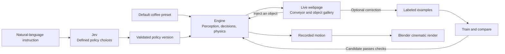

# Historical local coffee plan

Preserved during consolidation. The active plan is `../plans/2026-09-19-coffee-interactive-learning-demo.md`.

---
date: 2026-09-19
planner: Codex
topic: Coffee sorting quality, live interaction, and measured adaptation
status: draft
owner: taras
source_branch: codex/coffee-sorter-upstream
source_revision: 3c620dc4e52bedfe098f44499ecabdd40f414ecb
---

# Coffee sorter: a working default, then natural-language adaptation

Taras, the first demo opens with a working coffee sorter. A user can watch it, inject objects, and inspect its decisions.
Natural language changes the default policy afterward. Corrections and retraining are optional next steps.

This is a draft for review. The asset task is running in the HackSpain swarm. A bounded Jev micro-spike completed eight requests.
The rest of the plan remains unimplemented.
The [revised architecture explanation](../research/2026-09-19-coffee-architecture.md) answers the two review comments in more detail.

## Working agreement

Taras owns testing, QA, and acceptance. Deliver small runnable increments and request feedback after each visible change.
Do not add unit tests unless a specific risk makes them strictly necessary. Explain that need before adding one.
Do not build a QA framework or test CLI for this demo. Keep existing tests available for Taras to run.
Builders may compile, build, or execute the minimum command needed to produce a reviewable result.
Do not describe an increment as accepted or fully tested before Taras confirms it.
Commit and push review revisions to `codex/coffee-sorter-upstream`. Keep the plan, evidence, and PR description consistent.

## Recommended sequence

1. Establish trustworthy measurements and select a default coffee configuration.
2. Connect that default to the live webpage.
3. Add natural-language policy changes through Jev.
4. Add an object map, optional corrections, and measured retraining.
5. Develop realistic assets and a cinematic clip alongside steps 2 through 4.
6. Prove product switching with one concrete coin task.

Each phase should be a separate implementation task and PR. The full roadmap is too large for one implementation session.
The first milestone is phases 1 and 2, plus a visual proof from phase 5.
Asset quality and the recording method are first-class deliverables, not final polish.

## What can run in parallel

| Track | Can start now | Boundary and next review |
|---|---|---|
| Sorting quality | Data split repair, profiling, and default experiments | Own classifier and evaluation files. Show one baseline comparison before a wider sweep. |
| Live webpage | Session transport and Three.js controls using the existing default | Own live service and web files. Show one injected object before adding more controls. |
| Assets and recording | Detailed beans, materials, camera composition, and replay import | Swarm owns new rendering assets. Show the first still, then three stills and one second of motion. |
| Jev | An isolated language-to-policy micro-spike | Eight requests completed. Inspect proposals before integrating with the live service. |

The live page need not wait for a better classifier. It can load a new model and preset later.
The artist need not wait for the live service. The existing replay supplies recorded motion.
After the spike, language integration depends on a defined policy contract and the live session boundary.
Learning from corrections depends on object examples and stable model versions. Coin work follows a working coffee demonstration.

Use separate branches and file ownership. Agree on object IDs, timestamps, policy versions, and appearance keys before integrating tracks.
This parallel schedule is proposed. Only the asset task and Jev spike were dispatched during this review.



## Current state and evidence

The implementation base is [upstream PR #2](https://github.com/jamipuchi/hackspain/pull/2), revision `3c620dc`, including upstream `fdfc11f`.
The main local checkout still contains the separate magnet experiment. Implementation must use the coffee branch or its merged successor.
Upstream now includes `vision_paper.py` and a separate physical-line prototype under `sim/line/`.
The merge preserves the coffee detector's optimized features and evaluation metadata while enabling the white-paper segmentation override.
The live Three.js session and learning controls in this plan remain unimplemented. The physical-line prototype does not supply that browser connection.

| Component | Current behavior and source |
|---|---|
| Object representation | 23 measured dimensions covering size, shape, color, brightness, and spots. `sim/coffee_sorter/vision.py:15` |
| Classification | Supervised gradient-boosted trees. A Mahalanobis distance measures departure from known good appearances. `classifier.py:32`, `classifier.py:95` |
| Training limitation | Collection discards object IDs. The split operates on observations. Anomaly statistics use all good observations. `classifier.py:70`, `classifier.py:106` |
| Policy | Product class and rejection policy are separate. Probability and anomaly determine rejection. `controller.py:80`, `controller.py:155` |
| Object history | Tracks and evaluation IDs exist. Standalone crops and editable examples do not. `controller.py:37`, `evidence.py:24` |
| Browser | Recorded poses, decisions, and outcomes. No live command channel. `export_replay.py:99`, `web/viewer.js:167` |

### Do the 23 features need to be discrete?

No. Code measures continuous values such as area, aspect ratio, and mean color directly from the image.
They remain numeric inputs to the local classifier. Jev does not need to output those measurements.
Jev's policy choices are discrete: for example, `keep`, `reject`, `unchanged`, or an unsupported request.
Its probabilities and scores can be continuous. A typed answer does not require every input or output to be a category.

```text
Image → measured values: area=41.2, aspect=1.6, dark_fraction=0.12
      → local visual classifier

“Keep faded beans” → Jev choice: action_faded=keep
                  → code updates a validated policy
```

For “group by shape,” Jev can select a defined feature family. Local code calculates similarity from the original numeric values.

The recorded default demonstration captures 51.5% of defects and loses 4.3% of good beans.
Those figures describe one synthetic run. They do not establish a robust operating point.
Reported engine speed is 13 to 37 wall seconds per simulated second. Browser smoothness cannot fix that bottleneck.

### Proposed first goal

| Measure | Initial target |
|---|---|
| Defects physically captured | At least 80% |
| Good beans wrongly rejected or spilled | At most 2% |
| Admitted feed rate | At least 500 beans per simulated second |
| Evidence | Three held-out seeds, at least 2,000 scored objects per seed, with counts and uncertainty |
| Interactive engine | Real-time factor at least 1.0 at the selected demo rate |
| Browser | At least 30 FPS on Taras's demo machine |
| Injection acknowledgment | p95 below 250 ms, measured separately from final sorting time |

These are proposed goals, not achieved results or hardware guarantees.
Compare candidates against the same baseline at both 500 and 1,000 beans/s. Reducing feed rate alone must remain visible in the comparison.
Keep good-bean loss as a constraint while maximizing capture and throughput. Report clean and degraded-lighting results separately.
If no configuration meets the goal, show the tradeoff and let Taras choose the next experiment. Do not change the goal silently.
More CPU cores help independent experiments. They do not automatically accelerate one sequential simulation by the same factor.

Revision `4dbc350` passed 72 simulator tests and five replay checks on this Mac.
The later upstream merge received syntax and diff checks. Those earlier test results do not validate the new merge.
The optional comparison with recorded physics failed across runtimes. Record platform metadata and preserve this known limitation.

## Boundaries that keep the demo honest

- Features describe observed appearance. Clusters group similar appearances. Labels describe classes. Policy determines which classes to reject.
- Good and bad need not form two visual clusters. Foreign materials and different defects can occupy several groups.
- Start with the existing local classifier. Jev handles occasional language decisions outside the per-frame control loop.
- Jev returns choices from supplied alternatives. It does not generate new visual features or unrestricted product code.
- Keep simulator truth in training and evaluation. Neither live predictions nor Jev receive hidden class labels.
- Preserve a locked evaluation set. Corrections to reviewed examples cannot alter that set.
- Model suggestions remain suggestions until accepted or independently checked. Their agreement does not establish truth.
- Keep cinematic materials separate from the inspection camera. A realistic render does not prove real-camera accuracy.

The requested taxonomy includes black, malformed, immature, sour, and foreign objects.
Black, sour, and several foreign objects exist. Malformed is only partly represented. Immature needs explicit data and validation.
The initial UI must show that coverage honestly. Do not rename `faded` to `immature`.

## Verification conventions for Taras

All paths below are relative to the coffee implementation checkout unless an absolute path appears.
Commands for new files define the proposed CLI contract. They become executable during their named phase.
They have not been implemented or run unless this document explicitly records a completed spike.
The commands below are handoff instructions for Taras, not permission for an automatic QA campaign.

Existing baseline commands:

```bash
npm ci --prefix sim/coffee_sorter/web
npm run build --prefix sim/coffee_sorter/web
```

Use the pinned coffee requirements in an isolated environment.
Existing simulator tests remain available through `python -m unittest discover -s sim/coffee_sorter -p 'test_*.py' -v` if Taras chooses.
UR5e checks need their picking requirements and Menagerie model. The optional replay comparison also needs a compatible recorded runtime.

## Phase 1: trustworthy evaluation and a default preset

### Deliverable and changes

Produce `runs/default-v1/report.md`, a dataset manifest, and `configs/default_demo.json`.
These new outputs select a measured default rather than assuming the overnight winner generalizes.

1. Extend `classifier.py` collection with run IDs, object IDs, crops, and feature versions. Exclude merged or partial components from singleton labels.
2. Split by `(run_id, object_uid)` and reserve separate seeds and appearance variants. Fit preprocessing and anomaly statistics on training data only.
3. Compare the baseline with lighting augmentation and a bounded sweep of feed rate, jet force, and existing nozzle controls.
4. Add new `evaluate_default.py` and `configs/default_eval.json`. Measure capture, good-bean loss, purity, admitted throughput, latency, and wall-time components.

Use development seeds for tuning and locked seeds for final evaluation. Persist both lists before tuning.
Require exactly one member from `Inspector.component_members()` before assigning an object label, following `openset.py:157`.
Nearest-centroid matching alone does not prove that a component contains one object.
Require each supported class in both partitions. If grouped sampling omits a rare class, collect more examples before training or reporting class recall.
Run paired comparisons with at least three independent streams. Report counts and uncertainty, including negative results.
Keep early-stopping validation grouped as well, or disable the estimator's automatic row-level validation split.
Select the highest measured throughput that meets the quality target chosen from the resulting tradeoff table.
Use the proposed 80% capture, 2% good-loss, and 500 beans/s goal unless Taras revises it after review.
Keep the original preset if candidates show no useful improvement.

### Verification

#### Runnable handoff

- [ ] Deliver `python sim/coffee_sorter/evaluate_default.py --config sim/coffee_sorter/configs/default_eval.json --out sim/coffee_sorter/runs/default-v1` for Taras.
- [ ] Record split membership and train-only statistics in the run manifest. Reject invalid data through normal runtime validation.

#### Taras's review checkpoint

- [ ] Show one baseline and candidate on the same stream before expanding the sweep.
- [ ] Taras inspects capture, good loss, throughput, timing, and example mistakes, then chooses the next run.

## Phase 2: the default sorter in a live webpage

### Deliverable and changes

Produce a service on the `hackspain` SSH host with an immediately usable green-coffee preset.
Keep `http://127.0.0.1:8890` available for local development and SSH forwarding.
Users can inject an object, select it, and observe the engine's decision and physical outcome.

1. Add `live.py` and a simulation session in a worker process. Keep CPU-bound simulation away from the network event loop.
2. Serve the existing Three.js interface through HTTP. Stream engine state through WebSocket using the existing pose and event definitions.
3. Add bounded injection commands and an object inspector. Show crop, predicted class, rejection reason, valve event, and eventual outcome.
4. Add reset, reconnect, command acknowledgments, and session limits. A reset changes the session ID and invalidates old commands and tracks.

Use `aiohttp` for HTTP and WebSocket support. Protocol handling justifies this dependency. Pin its tested version during implementation.
Keep one process per active session initially. Add no broker, distributed scheduler, or generalized plugin system.
Persist a bounded event log and snapshots. On reconnect, send a snapshot and events after the acknowledged sequence.
Discard obsolete pose updates when a client is slow. Retain decision, command, and outcome events.
Reuse pose shapes, not the complete replay metadata. The replay contains truth classes and future outcomes that a live observation must not expose.
Render packets carry opaque appearance keys and instance IDs. Publish outcomes only after the engine records them.
Construct all model inputs from server-side observations. Never build them from browser render state, injection metadata, or evaluator labels.

Begin at the feed rate that profiling supports. If the engine cannot maintain real time, label its actual simulation rate visibly.
An injected object enters through a physical spawn location. A browser click must not assign its predicted class or final bin.

### Verification

#### Runnable handoff

- [ ] `npm run build --prefix sim/coffee_sorter/web`
- [ ] `python sim/coffee_sorter/live.py --host 127.0.0.1 --port 8890 --preset sim/coffee_sorter/configs/default_demo.json`
- [ ] Provide the URL, one injection action, and the engine's command/event log. Do not add `check_live.py` or a new test suite.

#### Taras's review checkpoint

- [ ] Show one injected stone reaching a real engine outcome before implementing the full inspector.
- [ ] Taras checks reset, reconnect, responsiveness, and displayed timing, then gives the next feedback.

## Phase 3: natural-language changes through Jev

### Deliverable and changes

Produce a language control that modifies the working default using a visible, versioned policy proposal.
Example: “Keep faded beans, but reject black beans and foreign material.”

1. Add `jev_policy.py` and `configs/policy_language_cases.json`. Use a small HTTP client with typed questions and validated responses.
2. Ask Jev for supported product selection and per-class actions: keep, reject, or unchanged. Include unsupported intent as an explicit outcome.
3. Show the interpreted changes before activation. Apply a policy at a controlled boundary and tag later decisions with its version.

Unsupported classes, contradictory instructions, or uncertain answers leave the active policy unchanged and request clarification in the UI.
Numerical calculations, legal ranges, nozzle control, and deadlines remain deterministic code.
Do not place API credentials in browser code or saved examples.
The Jev client in the separate magnet PR is reference material. The coffee branch cannot import files that it does not contain.

For reproducible evaluations, pin Jev's resolved model version and store probabilities, response time, and usage.
Test English and Spanish instructions. Jev's schema guarantee does not guarantee correct interpretation.

### Completed micro-spike and its limitation

The [Jev evidence](../research/coffee-jev-policy-spike/results.md) records eight serial calls to `jev-1.13.0`.
Observed request latency ranged from 0.721 to 0.879 seconds. This small sample does not establish production latency or accuracy.
The first six requests exposed ambiguity in the experiment's product question and scoring rules. Preserve them as exploratory evidence.
Two refined requests separated product selection from capability and compiled `unchanged` actions against the current policy.
Both English and Spanish requests produced the requested effective policy, but both incorrectly marked the clear instruction as ambiguous.
The local activation gate therefore deferred both proposals. No policy was activated and no simulator ran during this spike.

Before integration, review whether the ambiguity question confuses a requested policy change with a contradiction against the current policy.
That explanation is a hypothesis. Do not remove the ambiguity gate just to make these two examples pass.
Taras should review a revised interpretation contract before another request batch or live integration.
The API reported 14,593 input tokens and 4,166 output tokens across all eight requests. It returned no billed cost.

### Verification

#### Runnable handoff

- [ ] Deliver `python sim/coffee_sorter/jev_policy.py evaluate --cases sim/coffee_sorter/configs/policy_language_cases.json --out sim/coffee_sorter/runs/jev-policy-v1` for Taras.
- [ ] Preserve raw and compiled policy proposals, timings, and usage. Do not activate a proposal during the micro-spike.

#### Taras's review checkpoint

- [ ] Taras reviews an English instruction, its Spanish equivalent, and an unsupported request before live integration.
- [ ] Show the interpreted change before activation. Return clarification instead of pretending to recognize an unsupported class.

## Phase 4: an object map and optional learning from feedback

### Deliverable and changes

Produce a gallery, a map of visual similarity, and a candidate model trained from optional corrections.
The default remains available throughout.

1. Add `object_examples.py`. Store crops, feature vectors, predictions, sample identities, and immutable model/policy versions.
2. Add a standardized PCA view using existing scikit-learn. Color by prediction or confirmed label, with the selected mode clearly visible.
3. Add `learning.py` for appended corrections, candidate training, evaluation, activation, and rollback.
4. Offer a separate review queue for a vision model's suggestions. Escalate only selected uncertain or novel samples, outside the frame loop.

Start with the 23 existing features. PCA is a projection, not a clustering algorithm or accuracy measurement.
Show nearby examples and good/bad filters first. Add unsupervised groups only if they improve inspection on real examples.
Do not force two clusters. Freeze the projection during a comparison so movement cannot masquerade as learning.
An instruction such as “group by shape” can select a predefined feature subset through Jev.
Local code computes the view. Label that view change separately from training or policy changes.

“Good/bad” corrections are policy-specific. Store their policy version and optional defect tags.
Do not turn a binary rejection correction into an invented physical class label.
Use class corrections to retrain the class model. Evaluate binary-only corrections as a separate policy learner before integrating them.
Keep class-based mass estimates distinct from any learned rejection score.

Train candidates in the background. Compare them on untouched objects under the same policy and physical scenarios.
Activate only candidates that meet declared regression limits. Show measured results even when the candidate fails or performance decreases.
This is supervised learning with review, not reinforcement learning of actuator behavior.

### Verification

#### Runnable handoff

- [ ] Deliver `python sim/coffee_sorter/learning.py evaluate --dataset sim/coffee_sorter/runs/default-v1/dataset.json --out sim/coffee_sorter/runs/learning-v1` for Taras.
- [ ] Show the model version, unchanged holdout membership, sample count, and candidate comparison in normal output.

#### Taras's review checkpoint

- [ ] Show the gallery and similarity map before adding training controls.
- [ ] Taras corrects one example and reviews the candidate before deciding whether to activate it.

## Phase 5: realistic assets and the cinematic clip

### Deliverable and changes

First produce three stills and one second of cinematic motion, with a browser-compatible asset sample where practical.
After visual review, expand this into the cinematic demo.
Lead delegated this work to Astra through the [HackSpain task](https://hack.agent-swarm.dev/tasks/87808952-b84e-444b-938c-16741b75b078).
The [asset task](https://hack.agent-swarm.dev/tasks/6ef230e2-c8fe-4fb6-bce5-cf423431d68a) is running on `codex/coffee-realistic-assets`.
The [recording task](https://hack.agent-swarm.dev/tasks/a7cae1ea-d219-4101-914e-a4c52b1bd562) waits for that asset task.
Astra reported a first still and is correcting its exposure. That report does not mean Taras accepted the assets.
These statuses describe the September 19 review snapshot. Follow the task links for later progress.

1. Create reference-based or scanned prototypes for good, black, insect-damaged, and broken beans. Record asset sources and licenses.
2. Author detailed geometry and materials in `rendering/coffee_demo.blend`. Include creases, irregular silhouettes, surface damage, and restrained material variation.
3. Add `rendering/import_replay.py`. Import recorded identities, dimensions, positions, quaternions, and valve events into Blender.
4. Export simplified GLB prototypes with baked PBR maps where practical. Separate simpler browser assets are acceptable if sharing compromises the film or interaction.

Use Cycles for the film and Three.js for interaction. Arbitrary Blender shader nodes do not transfer directly to glTF.
Bake color, roughness, and normal detail. Use geometry for broken silhouettes that normal maps cannot express.
Align model origins, axes, dimensions, and contact surfaces with the physics bodies. Do not animate a better sorting result than the engine produced.

Hyperrealism depends on assets, lighting, materials, and camera work. Choosing Blender alone will not achieve it.
The camera used for evaluation remains unchanged. Training from realistic renders would require a separate controlled experiment.
Blender was not found on the local or HackSpain host PATH during inspection. The swarm can use an isolated worker installation.

### Recording method

Record the authoritative engine trajectory once. Render the film from that data offline, independently of browser screen capture.
Save object identity, dimensions, poses, timestamps, decisions, valve events, outcomes, and source/model/policy versions.
Save camera keyframes, lighting, materials, frame rate, sample count, and output settings with the Blender project.
The shipped replay is near 30 Hz. Use it for the first visual proof and label that sampling limit.
For close-up slow motion, capture a separate trajectory at 120 Hz or higher after reviewing interpolation around collisions and jet events.
The existing exporter accepts `--fps`. Increase capture frequency without replacing the shipped viewer dataset.
Taras reviews bean realism and camera composition before a full cinematic render starts.

### Verification

#### Runnable handoff

- [ ] Deliver the assets and `blender --background sim/coffee_sorter/rendering/coffee_demo.blend --python sim/coffee_sorter/rendering/import_replay.py -- --replay sim/coffee_sorter/web/replay.json --frames 1:30 --out /tmp/coffee-cinematic-preview`.
- [ ] Provide source files, exact render settings, render duration, and an asset-size report. No new unit tests or frame-check framework.

#### Taras's review checkpoint

- [ ] Show the first still promptly, then three close-up stills before the full film.
- [ ] Taras reviews realism, defects, camera composition, and the simpler Three.js fallback independently.

## Phase 6: a concrete product switch

### Deliverable and changes

Demonstrate coffee to one defined euro-versus-penny task, with visible model state and measured adaptation.
Choose exact denominations and labeled references before implementation.

1. Add the second physical product fixture and its data. Validate cylinder geometry, mass, camera visibility, and actuator feasibility first.
2. Extract only the shared product fields that both working examples require. Keep feature schema, labels, policy, assets, and physical parameters explicit.
3. Switch products by ending the previous episode and starting a new versioned episode. Clear tracks, queued actions, and incompatible model state.
4. Compare pretrained switching with learning from new examples. Show them as separate modes with separate evaluation histories.

Do not assume coffee features can read coin denomination or that coffee jets can eject coins reliably.
If the actuator cannot handle the second product, report that result and choose a supported mechanism before presenting physical sorting.
Natural language selects or modifies supported configurations. Unknown products request examples rather than generating unchecked engine code.

### Verification

#### Runnable handoff

- [ ] Deliver `python sim/coffee_sorter/learning.py evaluate --dataset sim/coffee_sorter/runs/coins-v1/dataset.json --out sim/coffee_sorter/runs/coin-adaptation-v1` for Taras.
- [ ] Expose episode IDs, model changes, and outcomes in the UI and log.

#### Taras's review checkpoint

- [ ] Taras chooses the exact coin task, then reviews one physical switch before adaptation work expands.
- [ ] Show loading a pretrained model and learning from new labels as separate actions with measured results.

## Deployment on the HackSpain box

The `hackspain` SSH alias works. The host reports 32 vCPUs and about 128 GiB RAM.
It already runs the swarm, agent-fs, and Caddy. The inspected display device is virtual, so accelerated rendering remains unverified.

```text
Browser: Three.js frontend on Vercel
    │ HTTPS requests and WSS connection
    ↓
API subdomain: DNS points to the HackSpain box
    ↓
Existing Caddy: TLS and reverse proxy
    ↓
Python service: live sessions, model inference, training jobs
```

Use a custom domain managed through Vercel, with a separate API subdomain pointing to the box.
The exact hostname remains to be selected before DNS changes. This review makes no DNS or service changes.
Keep long-running engine state on the box. The Vercel webpage connects directly to its WSS endpoint.
Allow the configured frontend origin and keep session credentials and provider keys on the backend.

Use the server for independent training runs, seed comparisons, and rendering jobs as well.
Begin with an aggregate bulk-work budget of 24 vCPUs and 96 GiB RAM, leaving capacity for live sessions and swarm services.
Account for worker count multiplied by native-library threads. Avoid launching several jobs that each claim all 32 CPUs.
Increase or lend idle capacity after observing latency. Interactive work should take priority over long rendering or training jobs.
This is a starting allocation, not a measured capacity guarantee or an authorization to stress-test the host now.

## Sources for design choices

- [TypeSafe state](https://docs.typesafe.ai/concepts/state): current Jev input is text or structured text.
- [TypeSafe primitives](https://docs.typesafe.ai/primitives): supplied choices and typed results.
- [TypeSafe models](https://docs.typesafe.ai/models): version pinning and domain configuration without customer fine-tuning.
- [Grouped splits](https://scikit-learn.org/stable/modules/generated/sklearn.model_selection.GroupShuffleSplit.html) and [PCA](https://scikit-learn.org/stable/modules/generated/sklearn.decomposition.PCA.html).
- [aiohttp server](https://docs.aiohttp.org/en/stable/web_quickstart.html): HTTP and WebSocket support.
- [Blender rendering](https://docs.blender.org/manual/en/5.1/render/introduction.html) and [glTF materials](https://docs.blender.org/manual/en/5.1/addons/import_export/scene_gltf2.html).
- [Three.js instancing](https://threejs.org/docs/pages/InstancedMesh.html): shared geometry and material with per-object transforms.

## Review priorities and remaining decisions

- Separate achieved results from proposed targets. The quality and real-time goals still need evidence.
- Review phase boundaries and shared contracts before independent tracks modify the same data structures.
- Resolve Jev's false ambiguity without treating two successful policy compilations as proof of reliable language control.
- Choose a domain and session access policy before public deployment. Keep provider credentials on the HackSpain backend.
- Confirm the first asset stills with Taras before expanding the cinematic work.
- Keep coin recognition and actuation deferred until the coffee demonstration works.

All eight comments from the second file review are incorporated. The complete roadmap remains a draft pending Claude Code and Taras's review.

## Manual E2E

Taras runs these steps after phases 1 through 3. Commands for `live.py` and `jev_policy.py` describe future deliverables.
Load credentials into the backend environment. Use the implementation branch and its actual checkout path in place of the placeholders.

On the HackSpain host:

```bash
ssh hackspain
cd <coffee-checkout>
git fetch origin
git switch <implementation-branch-based-on-coffee-pr>
python3 -m venv .venv-coffee
source .venv-coffee/bin/activate
python -m pip install -r sim/coffee_sorter/requirements.txt
npm ci --prefix sim/coffee_sorter/web
npm run build --prefix sim/coffee_sorter/web
python sim/coffee_sorter/live.py --host 127.0.0.1 --port 8890 --preset sim/coffee_sorter/configs/default_demo.json
```

In a separate local terminal, keep this tunnel open:

```bash
ssh -N -L 8890:127.0.0.1:8890 hackspain
```

In another local terminal:

```bash
curl --fail http://127.0.0.1:8890/health
open http://127.0.0.1:8890
```

Inject a defect through the UI and inspect its physical outcome.
Enter the faded-bean instruction, inspect the proposed policy, and activate it only after checking its meaning.
Reset the session and verify that the shipped default returns.
For a separate language evaluation, run this command in the backend checkout:

```bash
source .venv-coffee/bin/activate
python sim/coffee_sorter/jev_policy.py evaluate --cases sim/coffee_sorter/configs/policy_language_cases.json --out /tmp/coffee-jev-e2e
```

After the deployment task, repeat the interaction against its verified frontend URL.
Use `curl --fail "$COFFEE_API_BASE_URL/health"` for the backend health check.
Report network latency and host capacity separately from local results. Record Taras's feedback before the next increment.
