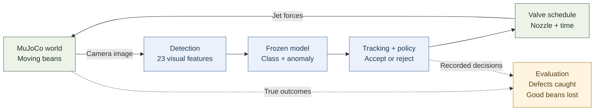
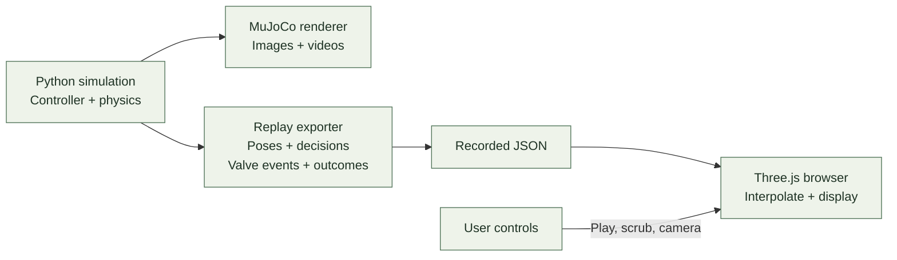

# Coffee sorter: what exists, and where your goals fit

Taras, the current system has three parts: a simulated machine, a classifier trained offline, and viewers that display results.
The classifier stays fixed during each run. The browser currently plays a recording.

Source snapshot: simulator [PR #1](https://github.com/tarasyarema/hackspain/pull/1), commit `340e734`. Browser [PR #3](https://github.com/tarasyarema/hackspain/pull/3), commit `c88c26f`.
The browser PR merged into the fork. [Upstream PR #2](https://github.com/jamipuchi/hackspain/pull/2) combines both with Jaume's main at `84f8ad5`.

## 1. What happens to one bean



1. **The world moves objects.** MuJoCo simulates the conveyor, bean shapes, collisions, air-jet forces, and splitter outcomes.
2. **The camera renders pixels.** Detection separates objects from the blue belt and calculates shape, size, color, and dark-spot features.
3. **The model classifies each blob.** A local scikit-learn classifier returns class probabilities. A separate anomaly score measures distance from known good beans.
4. **The controller follows the object.** It combines observations, applies the rejection policy, and predicts when the object will reach the jets.
5. **The scheduler commands the valves.** Later physics steps apply the forces. A correct rejection decision can still miss the bean or eject its neighbor.

Simulator truth supplies training labels and evaluation. It does not supply the optical controller's class decisions or target coordinates.
The controller uses camera features, calibration, and profile-based physical estimates.

Sources: [runtime](https://github.com/tarasyarema/hackspain/blob/340e734d06a91b589248ab6d35f20520ebab22b6/sim/coffee_sorter/run.py#L197-L289), [vision](https://github.com/tarasyarema/hackspain/blob/340e734d06a91b589248ab6d35f20520ebab22b6/sim/coffee_sorter/vision.py#L78-L169), [controller](https://github.com/tarasyarema/hackspain/blob/340e734d06a91b589248ab6d35f20520ebab22b6/sim/coffee_sorter/controller.py#L93-L200), [physics](https://github.com/tarasyarema/hackspain/blob/340e734d06a91b589248ab6d35f20520ebab22b6/sim/coffee_sorter/sim.py#L219-L296).

## 2. Where the model comes from

```text
Product profile + synthetic camera images + simulator labels
                             ↓
                  Extract visual features
                             ↓
           Train classifier and anomaly threshold
                             ↓
                    Save model.joblib
                             ↓
           Load once when a sorting run starts
```

The classifier uses gradient-boosted trees on 23 features. It does not call Astra, Jev, or another language model for each bean.
Training produces the classifier, a definition of normal appearance, and class metadata. The product profile supplies physical estimates.

Two product profiles exist: **green arabica** and **roasted coffee**. Each profile defines classes, appearance, dimensions, density, defect frequency, and severity.
The CLI selects a profile and saved model at startup. There is no online training, runtime product discovery, or natural-language configuration.

The reported 98% classification results use a random split of blob observations. Repeated views of one bean can appear in both partitions.
That score does not establish accuracy on unseen beans or real coffee.
The anomaly model also uses all good observations. Its statistics must use training objects only in the next evaluation.

Sources: [training and model](https://github.com/tarasyarema/hackspain/blob/340e734d06a91b589248ab6d35f20520ebab22b6/sim/coffee_sorter/classifier.py), [profiles](https://github.com/tarasyarema/hackspain/blob/340e734d06a91b589248ab6d35f20520ebab22b6/sim/coffee_sorter/profiles.py), [startup selection](https://github.com/tarasyarema/hackspain/blob/340e734d06a91b589248ab6d35f20520ebab22b6/sim/coffee_sorter/run.py#L197-L218).

### Features, clusters, and learning

The current model receives 23 numbers for each visible blob:

| Measurements | Dimensions | Examples |
|---|---:|---|
| Geometry | 8 | Area, long and short axes, aspect, fill, solidity, bounding width and height |
| Color | 8 | Mean RGB, mean HSV, red/green ratio, green/blue ratio |
| Brightness and surface variation | 7 | Gray mean and variation, saturation variation, dark and bright fractions, dark-spot count and area |

Training pairs these numbers with known class labels. The classifier learns to predict those labels.
The anomaly model measures distance from known good appearances. Neither component performs unsupervised clustering.

Similar appearance does not necessarily mean the same quality. A stone and a black bean can both be rejected for different reasons.
Good and bad are therefore policy decisions, not necessarily two natural visual clusters.

For your proposed UI, I recommend this progression:

```text
OPEN DEMO
Default coffee model + specialty policy are already active
    ↓
Watch conveyor → select an object → inspect crop and decision
    ↓
Optional instruction: “Keep faded beans, reject black beans”
    ↓
Jev selects defined policy choices → preview → activate version
    ↓
Optional correction → train candidate → test unseen objects
```

Jev accepts text and structured text. It selects from choices we define, so it can interpret supported policy changes.
The vision pipeline still supplies appearance measurements. Jev cannot discover image features from a photograph directly.
Sources: [TypeSafe inputs](https://docs.typesafe.ai/concepts/state), [typed questions](https://docs.typesafe.ai/primitives).

The object view should connect a thumbnail gallery with a map of visual similarity.
Select a point to see the crop, predicted class, rejection reason, confidence, and physical outcome.
Color the map by prediction or confirmed label. Make the selected meaning explicit.
Start with a standardized PCA projection and nearby examples. Add clustering only if it helps users inspect those examples.
PCA compresses the feature vectors for display. It does not create good/bad labels.
For “group by shape,” Jev could select a predefined feature subset. Local code would compute the groups or similarity view.
That would change the view, not train the sorter.

Manual corrections and another vision model can both help collect training examples.
Keep model suggestions separate from confirmed labels, and measure new models on untouched objects.
This would be supervised learning with review. Reinforcement learning of jet behavior would be a separate experiment.
The default must work before users provide language instructions or corrections, as you requested.

## 3. What the browser and renders do today



The [published browser demo](https://hack.agent-swarm.dev/p/07a0b9015bac42d0b779988efdcfb9e8) now works. I opened it and checked its playback controls.
It contains four seconds of recorded physics, with 4,000 beans and at most 551 visible together.

The browser reconstructs the machine and interpolates recorded object poses. Its counters and valve effects come from the recording.
Playback speed changes the viewing speed. It does not change feed rate, rerun the model, or alter sorting outcomes.

There is no browser-to-engine command channel, live model service, or click-to-add-object behavior yet.
The web branch starts from `main`. Its exporter explicitly uses the improved simulator revision from PR #1.

Current images use MuJoCo or Three.js. A cinematic Blender/Cycles export is still a possible extension, not a completed component.
The UR5e infeed experiment is separate. Its idealized grasp assumptions do not apply to the optical sorting loop.

Sources: [viewer and recording contract](https://github.com/tarasyarema/hackspain/blob/c88c26f8790f87ca10a686da3fa9228e30db53c8/sim/coffee_sorter/web/README.md), [exporter](https://github.com/tarasyarema/hackspain/blob/c88c26f8790f87ca10a686da3fa9228e30db53c8/sim/coffee_sorter/export_replay.py), [viewer](https://github.com/tarasyarema/hackspain/blob/c88c26f8790f87ca10a686da3fa9228e30db53c8/sim/coffee_sorter/web/viewer.js).

## 4. Three different meanings of speed

| Quantity | What it measures | Current limitation |
|---|---|---|
| Feed rate and belt speed | Objects admitted each simulated second, and their travel speed | More touching objects can worsen detection and ejection. |
| Engine speed | Wall time needed to simulate one second | Reported runs need 13 to 37 wall seconds. Camera backlog is unmodelled. |
| Viewer speed | Frames displayed each real second | Smooth playback does not prove the engine runs in real time. |

For the sorting sweet spot, measure defect capture, good-bean loss, output purity, and actual admitted throughput together.
The 1,000 beans/s demonstration captured 51.5% of defects and wrongly rejected 4.3% of good beans.
The separate clean sensor reference captured 48.7% and wrongly rejected 4.1%. These are different runs, not interchangeable baselines.

Source: [measured results and limitations](https://github.com/tarasyarema/hackspain/blob/340e734d06a91b589248ab6d35f20520ebab22b6/sim/coffee_sorter/MORNING_REVIEW.md).

## 5. Where your four goals fit

These are extension points for discussion, not an implementation plan.

| Your goal | Existing foundation | Missing capability |
|---|---|---|
| Better sorting and a useful speed | Classifier, controller, physical scoring, experiment scripts | Lighting robustness, independent test beans, longer comparisons, better jet targeting |
| Cinematic demo | Real trajectories, geometry, video export, Three.js materials | A chosen cinematic renderer, detailed visual assets, camera choreography |
| Live operations webpage | Three.js machine view and recorded counters | Running engine sessions, a command API, streamed state, live outcomes |
| Switch coffee to coins and adapt | Product profiles, saved models, shared controller | Product-neutral contracts, compatible sensing and physics, feedback, training and validated model replacement |

For a cinematic render, reuse the measured trajectories with richer visuals. Keep that renderer separate from the camera used to measure model performance.

For the live webpage, the browser sends actions such as adding an object. The engine owns object motion, model decisions, and outcomes.
The webpage displays returned state. Rendering the machine and executing the model are separate deployment concerns.

For product switching, the policy must define what counts as good. The model must recognize it, and the actuator must suit its size and mass.
Changing coffee to coins therefore affects more than labels and meshes.

## 6. Your specialty-coffee context

| Defect you named | Current representation |
|---|---|
| Black beans | Explicit `black` class |
| Malformed beans | No exact class. `broken` and `shell` cover specific shape defects. |
| Immature beans | No explicit green-coffee class. Do not equate `faded` with immature. |
| Sour beans | Explicit synthetic `sour` class |
| Foreign materials | `stone`, `stick`, and `husk`; separate tests add synthetic plastic and unusual objects |

These names currently describe simulated appearances. They do not establish that real images reliably identify each defect.
The specialty policy rejects minor and major defects. The commercial policy accepts the configured minor classes.

Source: [product definitions](https://github.com/tarasyarema/hackspain/blob/340e734d06a91b589248ab6d35f20520ebab22b6/sim/coffee_sorter/profiles.py), [decision policy](https://github.com/tarasyarema/hackspain/blob/340e734d06a91b589248ab6d35f20520ebab22b6/sim/coffee_sorter/controller.py#L17-L47).

## 7. What “adapts” should mean

Your idea needs a visible learning process with a defined feedback source:

```text
Describe product and rejection rules
                 ↓
Create a checked product configuration
                 ↓
Collect labeled examples or user corrections
                 ↓
Train a candidate model and test separate examples
                 ↓
Activate a model version and measure outcomes
```

This is a proposed boundary. None of that runtime adaptation exists today.

Switching to a pretrained model demonstrates reconfiguration. Training from new feedback demonstrates learning. Both are useful, but they tell different stories.
Accuracy does not necessarily fall to zero after a switch. Show the measured result, sample count, and model version instead of an animated improvement curve.
Live accuracy requires labels. The simulator can score with hidden truth. A real deployment needs inspected samples or corrections.

Natural language could produce a checked configuration and training job. I recommend this boundary before allowing generated code to modify the running controller.
It makes changes observable and preserves a meaningful comparison between model versions.

The first planning distinction is therefore: **sorting quality**, **cinematic presentation**, **live interaction**, and **measured adaptation** are four connected capabilities.
We can share their data and scene definitions while keeping their responsibilities clear.

## 8. Proposed next work and realistic renders

The [implementation plan](../plans/2026-09-19-coffee-interactive-learning-demo.md) starts with reliable evaluation and a working default webpage.
Natural-language changes follow. The object map, optional corrections, and a concrete coin task extend that foundation.

I recommend **Blender Cycles for the cinematic clip and Three.js for the interactive page**.
Cycles supplies the offline renderer. Detailed bean assets, believable materials, lighting, and camera work supply the realism.
Use scanned or carefully modeled reference beans, with actual geometry for creases and broken silhouettes.

Reuse the same recorded motion in both views. Export simpler GLB assets with baked materials for the browser.
Arbitrary Cycles materials will not transfer directly. Preserve instancing so hundreds of beans can share geometry and materials.
Sources: [Blender rendering](https://docs.blender.org/manual/en/5.1/render/introduction.html), [glTF materials](https://docs.blender.org/manual/en/5.1/addons/import_export/scene_gltf2.html), [Three.js instancing](https://threejs.org/docs/pages/InstancedMesh.html).

The first visual review should contain three close-up stills and one second of Cycles motion.
Include a browser asset sample where practical. Separate simpler browser assets are acceptable.
Approve the bean appearance before spending time on a full cinematic render.
Keep these presentation assets separate from the inspection camera until a dedicated evaluation measures their effect on classification.
