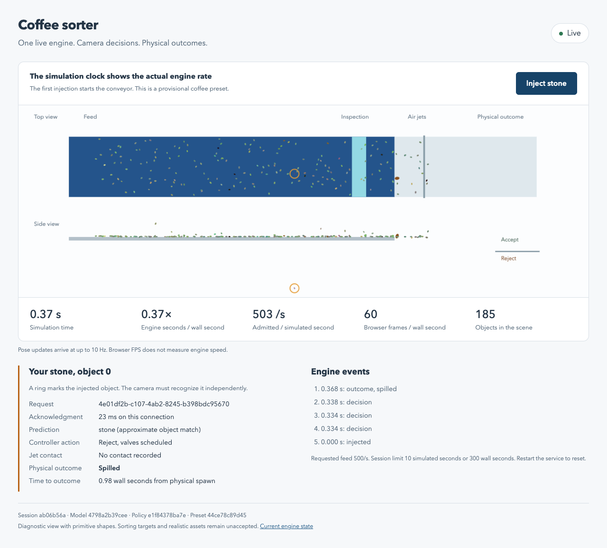

# First live coffee engine checkpoint

Taras, the first bounded increment is runnable. Functional QA and acceptance remain yours.
The 80% capture, 2% good-loss, and real-time targets remain unmet.

Implementation: `codex/coffee-core-live`, based on upstream coffee revision `4d0f705`.
The final demonstration ran code revision `51181c3`. Its recorded engine source hashes match the current source bytes.

## What changed

- Revised the plan against all 18 review findings before implementation.
- Added reproducible model bootstrap with separate training and holdout objects.
- Added one engine shared by diagnostics and the live service.
- Added loss attribution and component timing without changing the controller's decision rules.
- Measured one smaller body-pool candidate and selected it provisionally.
- Connected a separate diagnostic webpage to one local engine process.

Existing `web/viewer.js`, generated `web/index.html`, `export_replay.py`, and rendering assets remain unchanged.
The source checkout retains its untracked `.gitignore` and unpushed moodboard plan commit.
The main checkout retains the separate magnet experiment.
Taras's ownership confirmation remains pending, so this task modified no overlapping UI files.

## Run it

The [run guide](../../../../sim/coffee_sorter/LIVE.md) includes fresh-checkout installation, limits, reset, and diagnostic commands.
For the prepared worktree:

```bash
cd /private/tmp/hackspain-coffee-core
source .venv-coffee/bin/activate
python sim/coffee_sorter/bootstrap_model.py
python sim/coffee_sorter/live.py --host 127.0.0.1 --port 8890 --preset sim/coffee_sorter/configs/default_demo.json
```

Open [the local page](http://127.0.0.1:8890) and select **Inject stone**.
Stop the existing service before starting another on port 8890.
Ctrl+C stops the worker. Restart the command to create a new session.

## Final live demonstration

The final session used seed 8, 500 requested objects/s, 250 Hz inspection, a 400-body ellipsoid pool, and 0.06 N jets.
The simulation ran for 10 seconds with a browser connected throughout.

| Measurement | Observed result |
|---|---:|
| Engine wall time | 52.912 s |
| Engine rate | 0.189 simulated seconds per wall second |
| Spawned objects | 5,001, including the manual injection |
| Admitted throughput | 500.1 objects per simulated second |
| Peak active bodies | 331 |
| Pool starvation | 0 |
| Eligible objects | 4,301 |
| Defect capture | 356/674, or 52.82% |
| Capture Wilson 95% interval | 49.04% to 56.56% |
| Keep objects rejected or spilled | 234/3,627, or 6.45% |
| Good-loss Wilson 95% interval | 5.70% to 7.30% |
| Unresolved cohort objects | 1, retained in the denominator |
| Browser FPS sample | About 60, at 277 active objects |
| Injection acknowledgment sample | 23.3 ms |
| Injection spawn to outcome | 0.975 wall seconds |

The browser sample comes from headless Chrome on this Mac. It does not establish FPS on another device.
One acknowledgment sample does not establish p95 latency.
Pose updates arrive at up to 10 Hz, independently of browser FPS.
The live stream includes a manual injection and differs from the earlier diagnostic stream.
Do not treat its capture difference as a measured quality improvement.

### The injected stone

Command ID: `4e01df2b-c107-4ab2-8245-b398bdc95670`.
Session ID: `ab06b56a-c177-4503-973f-c30d4624b94f`. Object ID: `0`.

The camera produced three associated stone decisions. All scheduled rejection.
The associations use previous components and remain approximate. One component also contained another object.
The stone spilled at simulation time 0.366 s. It received no jet contact.
This demonstrates physical spawning, camera decisions, and an actual outcome. It does not demonstrate successful capture.



### Missed-defect partition

| Diagnostic category | Objects |
|---|---:|
| Not detected in a full component | 46 |
| Merged without a rejection target | 1 |
| Classification or tracking | 56 |
| Targeted without own-pulse hit | 161 |
| Own pulse hit without capture | 54 |
| Unresolved defects | 0 |
| Total missed defects | 318 |

These categories partition observations. They are not proven causes.
Another 31 captured defects had no associated own-pulse hit. Capture alone cannot establish that control caused it.
The largest missed-defect category points toward jet intersection work after Taras's checkpoint.

### Runtime costs

| Component | Wall ms per simulated second |
|---|---:|
| Physics | 528.2 |
| Inspection rendering | 731.4 |
| Detection | 851.8 |
| Model inference | 2,340.6 |
| Controller bookkeeping | 68.0 |
| Evaluation and object records | 672.9 |
| Snapshot construction | 38.7 |
| Remaining wall cost | 59.6 |

The model is the largest runtime cost. The smaller pool does not solve it.
The control path exceeded its 4 ms camera interval on 2,428 of 2,500 frames.
The worker uses a slower simulation clock. It does not emulate real-camera backlog or dropped frames.
`service-profile.json` records HTTP encoding and send distributions separately.
The wall residual includes IPC, scheduling, and other unattributed work.

## Bounded pool experiment

Both two-second development runs used the same model artifact, source hashes, seed, camera settings, and control settings.
Only the ellipsoid pool changed. Both admitted 1,000 objects, peaked at 266 active bodies, and recorded zero starvation.

| Measurement | 1,150-body pool | 400-body pool |
|---|---:|---:|
| Wall seconds | 10.070 | 9.336 |
| Engine rate | 0.1986x | 0.2142x |
| Physics ms per simulated second | 892.3 | 557.2 |
| Capture | 31/40 | 31/40 |
| Good loss | 13/261 | 13/261 |

Physics time fell 37.6%. Total wall time fell 7.3%. All measured quality counts and attribution counts matched.
This single short pair supports a provisional pool choice, not a general speed or quality guarantee.
Later source changes added reporting and reduced event transport. The pair predates those changes.
The final live demonstration above evaluates the resulting actual configuration.

The controller uses measured computation latency when scheduling valves.
Host load can therefore change physical outcomes, even with a fixed object seed.
Runs that overlapped live work remain separate and were excluded from this comparison.
An initial seed-101 diagnostic remains exploratory. Acceptance now reserves seeds 111, 112, and 113.

## Model bootstrap

Training used 5,565 observations from 1,706 seed-7 objects.
Holdout used 5,612 observations from 1,724 seed-9 objects.
The two partitions have no shared `(seed, object_uid)` identities.
All ten supported classes occur in both partitions.

Bootstrap completed in 24.872 wall seconds. A repeated bootstrap validated and reused the artifact.
Observation-weighted classifier accuracy was 93.10% on holdout observations.
That score excludes anomaly policy, tracking, and actuation. Repeated observations still weight objects differently.

The bootstrap excludes partial and merged components, disables row-level early stopping, and fits anomaly statistics on training data only.
Its provenance includes source files, runtime versions, 36 inspection textures, and the half-bean mesh.
The committed compact manifest preserves unique object membership. The generated full manifest retains every observation.

## Review and minimal verification

Standards review found no remaining blockers after fixes to terminal acknowledgments, process shutdown, event accounting, preset limits, and transport size.
Spec review confirmed truth isolation after clarifying that diagnostic counters are separate from independent train/holdout membership.
Spawn-to-outcome timing now uses worker timestamps. Native library thread limits and service timing distributions are recorded.
The cohort explicitly follows the existing closed interval convention.

Executed checks:

- Python syntax and JavaScript syntax checks.
- Model bootstrap and validated reuse.
- One bounded pair of development diagnostics.
- Live browser injection through a recorded physical outcome.
- Foreign-origin rejection, which returned HTTP 403.
- Service shutdown and restart while a browser was connected.

No unit tests or QA framework were added. No broad regression suite ran.
Public deployment, SSH-host performance, lighting robustness, and functional acceptance remain unverified.

## Evidence files

- `live.json`: final preset, versions, timings, quality counts, attribution, and injected-object history.
- `browser.json`: measured browser sample and displayed object state.
- `commands.jsonl`: the successful injection acknowledgment.
- `service-profile.json`: HTTP encoding and send timings.
- `pool1150.json` and `pool400.json`: the matched development screen.
- `bootstrap.json` and `model-manifest.json`: bootstrap results, provenance, and independent object membership.

Full local runtime evidence remains in `/tmp/coffee-live-checkpoint-51181c3`.
The acceptance checkpoint is Taras's functional QA of the live injection, displayed timing, and physical outcome.
No wider sweep, language integration, or rendering merge starts from this checkpoint automatically.
