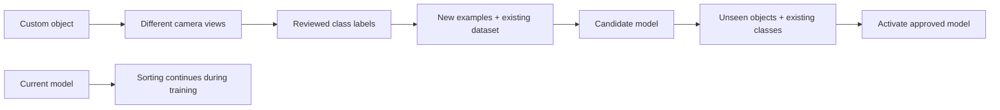
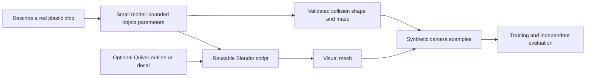

# Custom-object training and asset generation

## Research question

How does current training work? Could custom objects trigger training while sorting continues?
Could Quiver SVGs and an inexpensive model generate Blender objects on demand?

## Summary

The current sorter trains offline and loads one model when a live session starts.
A custom-object learning loop would require new dataset, candidate comparison, and model activation behavior.
The existing plan explicitly defers those features. This research does not implement them.

Quiver generates SVG. Blender can import SVG paths and extrude them into meshes.
That supports shallow shapes and decorative assets. An SVG does not establish hidden surfaces, material density, or realistic collision behavior.
My recommendation is a constrained object description plus a reusable procedural Blender script, with SVG as an optional input.
This recommendation is an engineering inference. No generation latency or model reliability was measured.

## Current training

1. Generate synthetic objects from the active profile using training seed 7.
2. Render the inspection camera and extract 23 measurements from each detected component.
3. Keep complete components that contain exactly one simulated object. Assign that object's class as the training label.
4. Fit a gradient-boosted classifier. Separately estimate how unusual an observation looks compared with training examples of good coffee.
5. Evaluate classifier predictions on different objects generated with seed 9.
6. Save the model, class list, feature metadata, training provenance, and artifact hash.

The last selected bootstrap took 26.50 seconds overall. Classifier fitting consumed 2.83 seconds of that total.
Most elapsed time therefore occurred outside classifier fitting. These figures describe this dataset and local machine only.
The live engine loads the saved artifact once. It has no training, correction, or model replacement command.

Training labels may use simulator truth. Live decisions still receive only image-derived observations.
Several frames of one object are several observations, not several independent objects.

## Proposed learning experience

Example: Taras introduces a red plastic chip and labels its class as `plastic_chip`.
Taras separately chooses the policy action: reject.

This would be training in the background, followed by a deliberate model change.
The present learner fits a complete candidate. Current code does not update it after each observed frame.
The candidate must retain old examples and face separate new-object and existing-class evaluation.
Physical comparison must measure capture and good loss together.

The existing anomaly detector might already reject the chip before learning.
The learning demonstration should therefore show recognition of the new class, plus the selected policy behavior.
A keep correction also needs an explicit anomaly rule. Today, a known kept class can still trigger anomaly rejection.

The class needs compatible profile metadata, physical dimensions, and density or mass.
The controller estimates pulse settings from predicted class mass. Appearance learning alone does not establish suitable physical actuation.
New dimensions also need camera examples that remain distinguishable through the current 23 features.

## Verified external capabilities

Quiver's generation endpoint returns SVG documents from a prompt and optional image references.
It does not return a Blender scene or volumetric mesh. [Quiver generation API](https://docs.quiver.ai/api-reference/create-svgs/generatesvg).

Blender imports SVG paths as curves in a plane. Those curves can be extruded or converted to meshes.
Its importer supports path geometry and ignores several presentation features, including gradients, text, images, and filters.
Units and orientation may need normalization. [Blender SVG importer](https://docs.blender.org/manual/en/latest/files/import_export/svg_curve.html).

Blender supports background scripts and GLB export through its Python API.
A proposed worker could construct a mesh and export the visual asset without an interactive Blender session.
[Blender command line](https://docs.blender.org/manual/en/latest/advanced/command_line/arguments.html), [export operators](https://docs.blender.org/api/main/bpy.ops.export_scene.html).

Gemini 2.5 Flash-Lite supports structured outputs. It is one candidate for producing bounded object parameters.
Application code would still validate dimensions, permitted shape families, and other values.
This research did not evaluate its generation quality. [Model capabilities](https://ai.google.dev/gemini-api/docs/models/gemini-2.5-flash-lite), [structured outputs](https://ai.google.dev/gemini-api/docs/structured-output).

## Cost examples

Prices were verified on 2026-09-19. They exclude local computation and retries.

| Component | Published price or calculated example |
|---|---|
| Quiver Arrow 1.1 | $0.20 per successfully generated SVG |
| Quiver Arrow 2 | $4 per million input tokens and $20 per million output tokens |
| Gemini 2.5 Flash-Lite, standard text | $0.10 per million input tokens and $0.40 per million output tokens |
| Example object description | 1,000 input tokens plus 2,000 output tokens costs $0.0009 through Flash-Lite |

The final row is arithmetic, not a measured request size or an end-to-end generation quote.
[Quiver pricing](https://docs.quiver.ai/developers/pricing), [Google pricing](https://ai.google.dev/gemini-api/docs/pricing#gemini-2.5-flash-lite).

## Recommended prototype, not implemented

Start with one supported family, such as a thin box for the chip.
Keep the visual mesh separate from the physical collider and mass parameters.
Generate and review assets outside the running simulation. Cache accepted results.
Use random pose and appearance variations for training, then different object variations for evaluation.

The current engine preallocates ellipsoid, half, box, and capsule pools. It cannot import arbitrary meshes during a session.
Adding an asset to the browser also does not add it to the inspection camera.
Both render paths and the physics representation need coordinated integration with their owners.

The reported 16 vCPUs and 128 GB RAM could support a separate asset and training worker.
GPU availability and resource contention remain unknown. This research cannot establish live update latency on that machine.

## Code references

All references describe source commit `1944538`.

| Source | Behavior |
|---|---|
| [bootstrap_model.py:81](https://github.com/tarasyarema/hackspain/blob/19445383e6554a4cb78386afd28f4e7e8638020a/sim/coffee_sorter/bootstrap_model.py#L81) | Isolated component collection and training labels |
| [bootstrap_model.py:130](https://github.com/tarasyarema/hackspain/blob/19445383e6554a4cb78386afd28f4e7e8638020a/sim/coffee_sorter/bootstrap_model.py#L130) | Classifier fitting and anomaly statistics |
| [vision.py:15](https://github.com/tarasyarema/hackspain/blob/19445383e6554a4cb78386afd28f4e7e8638020a/sim/coffee_sorter/vision.py#L15) | Twenty-three image features |
| [profiles.py:15](https://github.com/tarasyarema/hackspain/blob/19445383e6554a4cb78386afd28f4e7e8638020a/sim/coffee_sorter/profiles.py#L15) | Physical class specification |
| [controller.py:167](https://github.com/tarasyarema/hackspain/blob/19445383e6554a4cb78386afd28f4e7e8638020a/sim/coffee_sorter/controller.py#L167) | Class-based rejection and anomaly trigger |
| [engine.py:102](https://github.com/tarasyarema/hackspain/blob/19445383e6554a4cb78386afd28f4e7e8638020a/sim/coffee_sorter/engine.py#L102) | Startup model loading |
| [live.py:243](https://github.com/tarasyarema/hackspain/blob/19445383e6554a4cb78386afd28f4e7e8638020a/sim/coffee_sorter/live.py#L243) | Injection-only command handling |

## Open questions

- How diverse must custom objects become beyond the four supported shape families?
- Will labels come from synthetic definitions, Taras's reviewed camera crops, or both?
- What delay between teaching and candidate readiness is acceptable?
- Does the production host have a GPU suitable for inspection rendering?

These questions do not block the feasibility conclusion. They affect implementation scope and evaluation design.
No paid generation, simulation, deployment, engine change, or frozen-model change occurred during this research.
