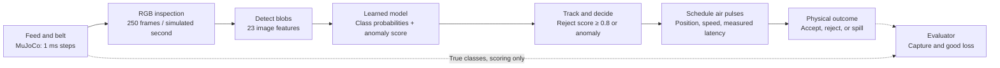
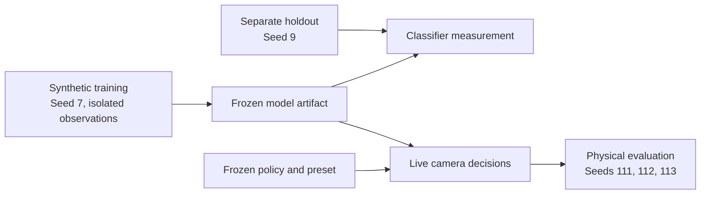
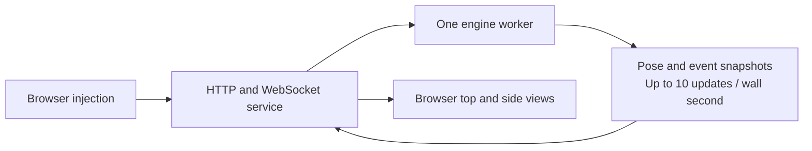

# How the coffee sorter works

The sorter receives camera images, predicts classes, and schedules air pulses.
MuJoCo determines the resulting motion. The evaluator measures whether each object reaches the correct path.

The evaluator's true classes, identities, velocities, and future positions never enter the control decision.
The controller estimates forward speed from camera observations. It does not estimate lateral speed.
The classifier predicts ten classes. The policy groups minor, major, and foreign classes into the rejection score.
An anomaly can trigger rejection even when the class-based rejection score stays below 0.8.

## What each stage does

| Stage | Current implementation | Main limit |
|---|---|---|
| Physical world | Feed objects onto a 3 m/s belt. Simulate collisions, gravity, air force, and the splitter. | Synthetic physics needs hardware calibration. Motion remains imperfect. |
| Inspection | Render a 2080 by 192 RGB strip at 250 Hz. Segment objects against the blue belt. | Touching objects can become one connected component. |
| Features | Measure shape, color, brightness, dark spots, and channel ratios. | Features can change with pose, overlap, and lighting. |
| Model | Use gradient-boosted trees for class probabilities. Measure anomaly distance from training observations of good objects. | A confident prediction can still be wrong. Training images are synthetic. |
| Tracking | Associate nearby blobs and average class probabilities across frames. Estimate forward speed. | Associations can be wrong. Lateral motion is not estimated. |
| Policy | Reject when defect probability reaches 0.8 or the anomaly threshold triggers. | Anomaly rejection can discard good objects. |
| Jets | Select nearby nozzles. Schedule pulses using travel time and actual compute latency. Scale light-object force below the pulse floor. | Contact does not guarantee enough deflection or a correct outcome. |
| Scoring | Compare the physical outcome against the required class for every eligible object. | Object-to-decision attribution is approximate. Outcome counts use simulator truth. |

## Training and live execution are separate

Holdout classification accuracy is 95.29%. It excludes tracking, anomaly policy, jets, and physical outcomes.
Frozen physical evaluation captured 899/1,041 required defects and lost 340/5,859 keep objects.
Every seed passed the capture bound. Every seed failed the good-loss bound.
The largest observed loss group contains good objects contacted by their own rejection pulse: 293 of 340.
That directs the next investigation toward perception, tracking, and policy. It does not prove one isolated cause.

## The browser is a viewer

The browser draws schematic projections of the engine's poses. It does not supply the inspection image.
Browser FPS, pose packet frequency, engine speed, and admitted feed rate measure different things.
One live session uses one worker. Native numerical thread limits remain one.
Production's reported 16 vCPUs and 128 GB RAM do not automatically parallelize this sequential control loop.
No production benchmark ran in this task.

## Source map

| Responsibility | Source |
|---|---|
| Engine loop, report, snapshot | `sim/coffee_sorter/engine.py`: 288, 372, 443 |
| Physical layout | `sim/coffee_sorter/scene.py`: 18 |
| Feed, forces, outcomes | `sim/coffee_sorter/sim.py`: 110, 224, 234 |
| Camera and features | `sim/coffee_sorter/vision.py`: 15, 67, 85 |
| Class probabilities and anomaly score | `sim/coffee_sorter/classifier.py`: 102 |
| Tracking, policy, scheduling | `sim/coffee_sorter/controller.py`: 122, 157 |
| Synthetic training and holdout | `sim/coffee_sorter/bootstrap_model.py`: 81, 130 |
| Worker and transport | `sim/coffee_sorter/live.py`: 25, 116 |
| Browser projections | `sim/coffee_sorter/live_web/live.js`: 124 |

Source references describe the frozen `codex/coffee-quality` configuration.
This task preserved shared UI interfaces and did not merge the separate UI or asset work.
